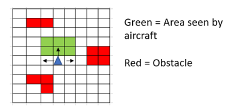

# Missouri S&T - CS 4091 - Capstone II

## Spring 2025 - Team O - Project 3

Jack Wyeth, Ethan Heckart, Matthew Lopez, Ryan Kluesner, Jimmy Hoerschgen

---

## Build / Install

1. Install the Conda environment using the `environment.yml` file in the project root.

2. Activate the Conda environment.

3. Run `build.sh` in the `\backend` directory.
    - This will require that `pybind` is installed in the Conda environment.
    - The build script will use CMake to build the backend and the bindings that will be used by the Python GUI.

4. To run the GUI, with the Conda environment installed execute the command: `python -m gui`  in the project root.

5. Profit

---

## Problem Description - _Air-to-Ground Search_

Aircraft can be used for collecting information about the terrain it is flying over. This is commonly done for search-and-rescue, geological surveys, infrastructure damage assessment, etc. In this project students must come up with a route that an aircraft will fly over a geographic area to collect information.

Use a 2D grid world model. Some grid cells are traversable, some are not. The aircraft can move one grid cell forward, move one grid cell left (a left turn), or move one grid cell right (a right turn). The aircraft cannot move backwards to a grid cell behind it. The aircraft has a sensor that can scan a 2x3 rectangle of cells ahead of it but the aircraft has a full map of the area prior to starting the flight. Figure 1 shows an illustration of this grid world concept.

__Goal__: Generate a route that satisfies the movement constraints, avoids obstacles, minimizes the number of cell movements, and scans at least 80% of all the grid cells. _Note that the obstacles could be shaped such that there are box canyons that the aircraft cannot turn around within. The algorithm must detect these
and avoid them._

_Figure 1 - Example Grid World_

Possible stretch goals (pending team size, expected difficulty levels, student workloads, etc):
1. Create multiple competing heuristics and/or algorithms. Analyze which provides better results and why.
2. New constraint: The aircraft can only move a total of X times. Maximize the grid world coverage within this constraint. __[DONE]__
3. What if we had two vehicles? Come up with routes that optimizes scanning the grid world using both
aircraft simultaneously.
4. Create a mechanism to visualize the problem and solution(s). __[DONE]__

## Project Architecture

### Frontend

- Model-View-Controller _(MVC)_ architecture.

- __Model__:
  - The model is responsible for managing the state of things that the user will be modifying when using the GUI.
- __View__:
  - The view is responsible for showing all the necessary data to the window.
- __Controller__:
  - The controller acts as the middleman between the view and the model that routes data and actions between the two.

### Backend

- __GridMap class__:
  - Vector of Cell vectors representing the map.
  Constructs map from a CSV file.
- __Aircraft class__:
  - Capable of moving forward, turning left, and turning right on a GridMap
  - `scan()` function converts GridMap Cells in the scanning area from unscanned to scanned.
- __RoutePlanner class__:
  - Generates an efficient route for _scanning >= 80%_ of traversable Cells in a GridMap.
  - Stores move sequence in a vector which is accessible by the frontend.

- The routing algorithm is based on A* search with some modifications.
- A Flood Fill algorithm is used to detect unreachable pockets of traversable Cells and mark them as untraversable.

### Binding

- Communication between the C++ backend and Python frontend is done via Pybind11 

- __PyBind11__:
  - _“a lightweight header-only library that exposes C++ types in Python and vice versa, mainly to create Python bindings of existing C++ code.”_ (https://pybind11.readthedocs.io/en/stable/)

- _Objective_:
  - Implement the search algorithm in C++ and the GUI frontend in Python via Tkinter
PyBind11 allows the project to take advantage of implementing the algorithm in a faster language like C++, while also taking advantage of the Tkinter Python library for creating a GUI where we are less concerned with performance.
